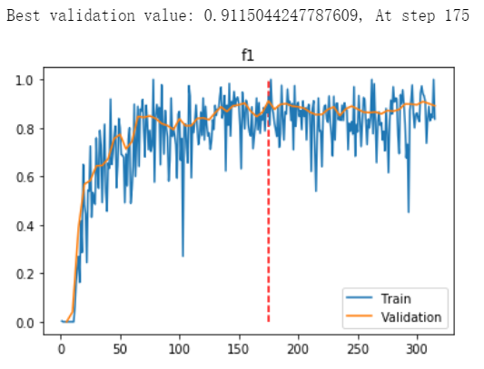

# ERNIE源码序列标注部分代码试验
作者: jzhang 
本次更新时间: 2019/11/25
## 摘要
本项目是我对ERNIE源码中命名实体识别（序列标注）部分代码的试验结果展示
### 代码分支
fork_ERNIE/jzhang_learn
### 试验环境和工具
Windows10 
PyCharm 
Jupyter Notebook 
Git Bash (在Windows平台上跑shell脚本用)
### 试验数据
ERNIE官方文档中提供的数据 - [link](https://github.com/jhmclean/fork_ERNIE/blob/develop/README.zh.md#%E4%B8%AD%E6%96%87%E6%95%B0%E6%8D%AE)

### 预训练模型
ERNIE 1.0 中文 Base 模型(max_len=512) - [link](https://github.com/jhmclean/fork_ERNIE/blob/develop/README.zh.md#%E9%A2%84%E8%AE%AD%E7%BB%83%E6%A8%A1%E5%9E%8B%E4%B8%8B%E8%BD%BD)
## 试验过程简述
### 主要改动文件
- ernie/run_sequence_labeling.py
- ernie/finetune/sequence_label.py
- script/zh_task/ernie_base/run_msra_ner.sh

### 新增文件
- checkpoints/learning_curves.{epoch}.{step}.pkl - 以字典的方式存储训练至第step时，模型的training metrics，validation metrics和test metrics
- checkpoints/test_result.{epoch}.{step} - 存储模型对test data的预测标注结果
- jzhang_docs/results_visualization.ipynb - 用于读取上述两种文件，并展示模型在test set上的预测结果和模型训练的learning curves

### 改动详解
我们可以用PyCharm中的代码比对工具进行清晰而详尽的比较。这里我做一些简要的例举和说明（以下所有截图中，图左半部分为Ernie原始代码，右半部分为我的相应改动）
#### 为了存储每一步的metrics（learning curves相关数据）
##### ernie/run_sequence_labeling.py

上图中，之所以要对f1, precision, recall进行`np.mean()`的处理，是因为经过单步跟踪，我发现原始的返回值是一个`shape=(1,)`的`np.array`

将这些数据存储成.pkl文件

##### ernie/finetune/sequence_label.py

在evaluate时额外返回loss值

原始代码中，evaluation函数返回格式化的字符串，以便在屏幕上打印信息，我修改为直接返回各项metric值本身

##### script/zh_task/ernie_base/run_msra_ner.sh
该脚本用于设置相关参数并运行ernie/run_sequence_labeling.py文件

文件中必须设置两个重要的环境变量：
- MODEL_PATH: 存放预训练模型的文件夹路径
- TASK_DATA_PATH: 存放训练和测试数据的文件夹路径

文件中包含的重要命令行参数
- init_pretraining_params: 预训练模型的参数文件存放路径
- batch_size: 每进行一次权重的更新需要训练多少样本
- train_set: 训练数据存放地址
- dev_set: 验证数据存放地址
- test_set: 测试数据存放地址
- learning_rate: 优化器的学习率
- save_steps: 每多少步保存一次模型
- skip_steps: 每多少步进行一次train指标的评估并打印。我设为1，即每一步都打印
- validation_steps: 每多少步进行一次validation（在修改的代码中，我也用该参数表示多久保存一次learning curves数据）。我设为5
- test_save: 测试结果（和learning curves相关数据）的存放地址

Git Bash中运行shell截图

### 学习曲线
#### 指标
loss, f1, precision, recall
#### 补充说明
训练时，每1步都在当前一个batch的训练数据(我设置的是batch_size=16)上进行4个指标的计算；验证时，每5步在整个dev set上进行4个指标的计算（为了节省时间，我从dev set中的2318条句子中随机选出155条，并命名为dev_small.tsv）。因此，training curves波动非常大，而validation curve平缓得多

由于原始代码中只有获取对测试数据的标注结果的接口（详见ernie/finetune/sequence_label.py中的predict函数），我在试验中将test_set和dev_set均设为实际的dev set的路径，以获取模型对dev set的标注结果

#### 参考截图
 

### 预测标注
对dev set的标注结果例举

## 试验复现
- 安装paddlepaddle的1.5版本（亲测：如果安装最新的1.6版本，后续会出错）
- Windows下，在项目的主目录下打开Git Bash，运行`sh script/zh_task/ernie_base/run_msra_ner.sh`
- ernie/run_sequence_labeling.py文件的程序入口处(`if __name__ == '__main__'`)有一片被我注释掉的参数设置区域。如果想直接运行.py文件进行试验，可以将这一块注释取消，然后直接设置参数并运行。需要注意的是，如果以shell调用的方式运行，则.py中的这块参数设置区域一定要被注释掉
- 脚本运行中，程序会不断向./checkpoints文件夹内写入learning_curves.pkl和test_result文件。打开jzhang_docs/results_visualization.ipynb，可载入这两项文件中的数据并做相关的可视化

## 主要参考
- ERNIE官方GitHub仓库上的中文文档，特别是命名实体识别（序列标注）部分 - [link](https://github.com/jhmclean/fork_ERNIE/blob/develop/README.zh.md)
- 百度飞桨官网 - [link](https://www.paddlepaddle.org.cn/)
- 这可能是第一篇比较全的ERNIE踩坑笔记 - [link](https://blog.csdn.net/a1058420631/article/details/90240285)